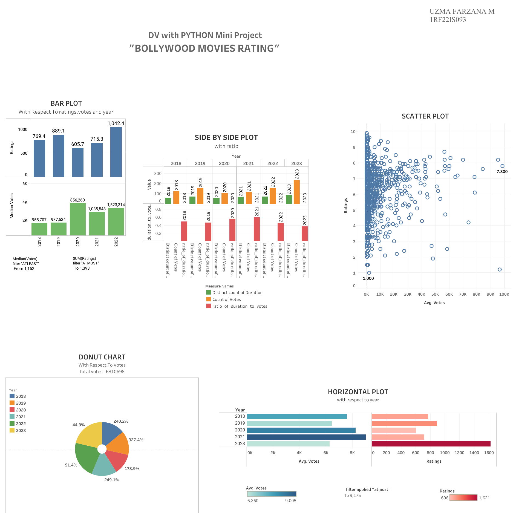

# 🎬 Bollywood Movies Rating Dashboard

This is an interactive Tableau dashboard that visualizes Bollywood movie ratings. It provides insights into trends, ratings distribution, and patterns across different years and genres.

📊 **Live Dashboard**:  
👉 [Click here to view it on Tableau Public](https://public.tableau.com/app/profile/uzma.farzana.m/viz/uzmafarzanam1rf22is093/BollywoodMoviesrating)

## 🖼 Preview

## 🛠 Tech Stack

- **Tableau Public** – For data visualization and dashboard creation
- **Excel/CSV** – For dataset management (if applicable)
- **Data Analysis** – Insights extracted using visual storytelling

## 📂 How to Use

1. Click the link above to open the dashboard.
2. Use filters and charts to explore the data interactively.

## 📬 Contact

- **Uzma Farzana M**
- ✉️ [uzmafarzana18@gmail.com](mailto:uzmafarzana18@gmail.com)
- 💻 [GitHub](https://github.com/03uzma)

